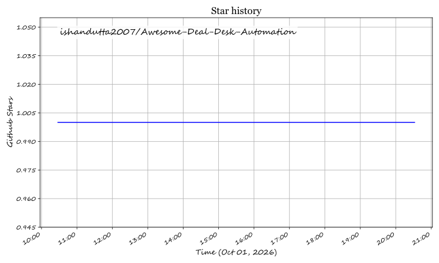

  

# 💼 Awesome Deal Desk Automation ⚡

## 🚀 Top Deal Desk Automation Platforms Ecosystem

**Curated List of SaaS Products & Open-Source GitHub Projects**  
*Focused on Quote-to-Cash Automation, CPQ, Deal Collaboration, Contract Lifecycle Management & Subscription Billing* 

**Last updated: October 2026** 📅

---

This repository tracks notable **SaaS platforms** and **open-source projects** for **Deal Desk Automation**. These tools help revenue operations (RevOps), sales operations, finance, and engineering teams automate quoting, product configuration (CPQ), pricing approvals, document generation, e-signature, contract management, and the automated handoff from deal closure to revenue recognition and subscription billing—reducing manual work and accelerating deal velocity ⚡.

### 📊 Sector Market Overview
> 💡 **Market Size & Structure**: The global Deal Desk Automation, CPQ (Configure, Price, Quote), and Billing Automation market is estimated at **~$3.8 Billion to $5.2 Billion** (2026), expanding at a CAGR of ~14.5%. The commercial SaaS sector is **moderately fragmented to concentrated**, dominated by enterprise revenue platforms (Salesforce Revenue Cloud, Conga, DealHub), while the SMB and open-source foundation remains highly composable and extensible.

---

## 📑 Table of Contents

- [🏢 Commercial SaaS / Hosted Platforms](#-commercial-saas--hosted-platforms)
- [🔓 Open-Source GitHub Projects](#-open-source-github-projects)
- [🤝 How to Contribute](#-how-to-contribute)
- [⭐ Star History](#-star-history)
- [💖 Support & Sponsorship](#-support--sponsorship)
- [⚠️ Disclaimer](#%EF%B8%8F-disclaimer)

---

## 🏢 Commercial SaaS / Hosted Platforms

Below is a curated comparison of leading enterprise and SMB Deal Desk SaaS platforms, sorted by estimated company scale (annual revenue/valuation) descending 📉:

| Platform 🛠️ | Description 📝 | Company Scale (Revenue / Valuation) 💰 | Starting Tier Price 💲 | Free Tier / Free Trial Limits 🎁 |
| :--- | :--- | :--- | :--- | :--- |
| **[Salesforce Revenue Cloud](https://www.salesforce.com/)** 🌩️ | Enterprise CPQ and billing suite providing guided selling, complex pricing rules, approval workflows, and revenue recognition natively inside Salesforce. | **~$34.9 Billion Revenue** | **$75** / user / month (Salesforce CPQ Starter) | **30-day free trial** with pre-configured sample sales & CPQ data. |
| **[Conga CPQ](https://conga.com/)** 📄 | Enterprise CPQ for complex quoting, pricing, and subscription lifecycles. Pairs product configuration with contract document automation. | **~$300 Million Revenue** | **$35** / user / month (Conga Composer / CPQ base) | **14-day free trial** with access to document automation and quote templates. |
| **[DealHub](https://dealhub.io/)** 🤝 | Agentic quote-to-revenue platform spanning CPQ, proposals, subscriptions, and DealRoom buyer-seller collaboration. | **~$30 Million Revenue** ($100M+ Valuation) | **$50** / user / month | **14-day free trial** available upon request via demo portal. |
| **[Ignition](https://ignitionapp.com/)** 📝 | Automates proposals, billing, payment collection, and client engagement for professional services and accounting teams. | **~$25 Million Revenue** ($120M+ Valuation) | **$49** / month (Core Plan, billed annually) | **14-day free trial** with unlimited proposal creation during trial. |
| **[QuoteWerks](https://www.quotewerks.com/)** 📦 | Turnkey CPQ and quote management for SMBs and MSPs. Features product configuration, pricing rules, and CRM integrations. | **~$15 Million Revenue** | **$15** / user / month (Standard Edition) | **30-day free trial** with full functionality for up to 5 users. |
| **[Logik.io](https://www.logik.io/)** ⚙️ | Headless, composable, API-first CPQ and product configuration engine powering rules across Salesforce and custom frontends. | **~$10 Million Revenue** ($80M Valuation) | **$2,000** / month (Base Enterprise Platform API) | **30-day sandbox developer trial** with full API access. |
| **[Quoter](https://quoter.com/)** ⏱️ | Cloud CPQ software built for SMBs, VARs, and MSPs to automate proposal creation, pricing approvals, and CRM sync. | **~$8 Million Revenue** | **$199** / month (Basic Plan, includes up to 5 users) | **14-day free trial** with full template and integration access. |
| **[Subskribe](https://www.subskribe.com/)** 💳 | Adaptive SaaS CPQ and billing platform engineered for complex subscription management, tiering, and usage pricing. | **~$5 Million Revenue** ($30M Valuation) | **$1,500** / month (Platform Base Tier) | **14-day guided test drive** with custom billing scenario simulation. |
| **[Expedite Commerce](https://www.expeditecommerce.com/)** 🏭 | CPQ and eCommerce engine built for B2B manufacturers and distributors with complex bill-of-materials and custom quotes. | **~$4 Million Revenue** | **$50** / user / month | **14-day demo environment trial** upon request. |

---

## 🔓 Open-Source GitHub Projects

The open-source deal desk ecosystem provides modular foundations across ERP/CPQ, B2B quotation portals, subscription billing engines, and eSignature automation. Sorted by **GitHub_Stars** (descending) 🌟:

| Open-Source Project 🛠️ | Category 🏷️ | Stars_Count 🌟 | License 📜 | Description 📝 |
| :--- | :--- | :--- | :--- | :--- |
| **[n8n](https://github.com/n8n-io/n8n)** ⚡ | Workflow Automation |  | Sustainable Use License | Fair-code workflow automation tool to orchestrate custom deal desk approval flows, CRM webhooks, and billing triggers. |
| **[Odoo](https://github.com/odoo/odoo)** 🏢 | ERP & Native CPQ |  | LGPL-3.0 / Commercial | The most comprehensive open-source ERP platform and foundation for deal desk automation, featuring native CPQ, CRM, and Sales modules. |
| **[ERPNext](https://github.com/frappe/erpnext)** 📊 | ERP & CPQ Foundation |  | GPL-3.0 | Complete open-source ERP with native Quotation, Sales Order, Pricing Rules, Customer Portal, and Invoicing modules. |
| **[Bagisto](https://github.com/bagisto/bagisto)** 🛒 | B2B Commerce & RFQ |  | MIT | Open-source Laravel B2B eCommerce framework supporting per-company custom pricing, quotes, and B2B ordering. |
| **[Activepieces](https://github.com/activepieces/activepieces)** 🔗 | RevOps Automation |  | MIT | Open-source no-code business automation tool for linking CRM quote events with eSign and billing notifications. |
| **[DocuSeal](https://github.com/docusealco/docuseal)** ✍️ | Document eSignature |  | AGPL-3.0 | Self-hosted document signing and form automation platform for contract execution and quote approvals. |
| **[Spree Commerce](https://github.com/spree/spree)** 🛍️ | B2B Portal & Quotes |  | BSD-3-Clause | Open-source B2B wholesale platform featuring customer-specific pricing, RFQ quote workflows, and catalog permissions. |
| **[Documenso](https://github.com/documenso/documenso)** 📄 | Digital Signing |  | AGPL-3.0 | Open-source document signing platform alternative designed to embed signing workflows into custom sales applications. |
| **[Lago](https://github.com/getlago/lago)** 💳 | Usage Billing & Metering |  | AGPL-3.0 | Open-source metering and usage-based billing platform designed for complex hybrid subscription and usage pricing. |
| **[Invoice Ninja](https://github.com/invoiceninja/invoiceninja)** 🧾 | Invoicing & Quotes |  | AGPL-3.0 | Self-hosted quote creation, client approval portal, invoicing, and recurring payment engine. |
| **[Crater](https://github.com/crater-invoice/crater)** 🖋️ | Quote & Invoice App |  | AGPL-3.0 | Open-source web & mobile invoicing platform designed for trackable quotes, estimates, and payment collection. |
| **[Kill Bill](https://github.com/killbill/killbill)** 🏦 | Subscription Billing |  | Apache-2.0 | Open-source enterprise subscription billing and payments engine powering multi-tier SaaS billing with zero vendor lock-in. |
| **[Virto Commerce](https://github.com/VirtoCommerce/vc-platform)** 🏢 | B2B Quoting Engine |  | Open Software License 3.0 | Enterprise B2B eCommerce platform with modular Quoter engine for price negotiations and discounts. |
| **[UniBee](https://github.com/UniBee-Billing/unibee)** 🐝 | SaaS Billing |  | AGPL-3.0 | Universal open-source billing system supporting subscriptions, billable metrics, and user management. |
| **[openCPQ](https://github.com/webXcerpt/openCPQ)** ⚙️ | Product Configurator |  | MIT | Lightweight browser-based JavaScript framework for building custom product configurators and knowledge bases. |
| **[Bagisto B2B Module](https://github.com/bagisto/b2b-ecommerce)** 🛍️ | RFQ & B2B Quoting |  | MIT | Open-source extension for Bagisto enabling request-for-quote (RFQ), quotation negotiation, and company credit ledger. |

---

## 🤝 How to Contribute

Contributions are welcome! Please follow these simple guidelines:

1. Fork this repository.
2. Edit `README.md` with new SaaS or Open-Source deal desk tools.
3. Keep descriptions factual, concise, and structured.
4. Open a Pull Request with a clear summary of changes.

---

## 📈 Star History

---

## 💖 Support & Sponsorship

If you found this curated ecosystem list helpful, please consider supporting the project! ⭐ **Star the repository**, share it with your RevOps & SalesOps network, or sponsor further updates:

- **Sponsor on GitHub**: [https://github.com/sponsors/ishandutta2007](https://github.com/sponsors/ishandutta2007) ☕
- **Join Community Discussions**: [Discord Community](https://discord.gg/jc4xtF58Ve) 💬
- **Explore More Lists**: [Awesome Awesome Awesome](https://github.com/ishandutta2007/Awesome-Awesome-Awesome) 🚀

---

## ⚠️ Disclaimer

- This is a **community-curated** repository provided for informational and educational purposes.
- Deal desk automation and CPQ systems process sensitive pricing matrices, contract terms, customer data, and financial transactions. Ensure proper security and regulatory compliance when deploying these solutions.

## ⭐ Star History

<a href="https://star-history.com/#ishandutta2007/Awesome-Deal-Desk-Automation&Timeline" align="center">
  <picture>
    <source media="(prefers-color-scheme: dark)" srcset="assets/ishandutta2007_Awesome-Deal-Desk-Automation_growth.svg">
    
  </picture>
</a>
